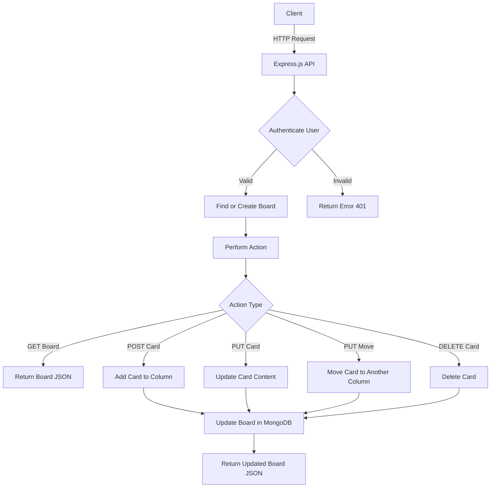

# Drag and Drop Board API

A powerful and flexible REST API for managing a drag-and-drop kanban board system. Built with Node.js, Express, and MongoDB, this API allows you to create, manage, and organize tasks across different columns with real-time updates.

## 🚀 Features

- ✨ Create and manage boards
- 📝 Add and edit cards
- 🔄 Drag and drop functionality
- 👥 User-specific boards
- 🔍 Real-time board updates
- 🎯 Column management
- ⏱️ Timestamp tracking for cards

## 🧰 Technologies Used

- [Node.js](https://nodejs.org/)
- [MongoDB](https://www.mongodb.com/)
- [Express](https://expressjs.com/)
- [Querymen](https://github.com/diegohaz/querymen) and [Bodymen](https://github.com/diegohaz/bodymen)
- [Yeoman](https://yeoman.io/)

## 📋 Prerequisites

Before you begin, ensure you have the following installed:

- Node.js (v14 or higher)
- MongoDB
- npm or yarn

## 🛠️ Installation

1. Clone the repository:
    ```bash
    git clone https://github.com/Cristian-Nascimento/boardAPI.git
    cd BoardAPI
    ```

2. Install dependencies:
    ```bash
    npm install
    ```

3. Create a `.env` file in the root directory and add your environment variables:
    ```env
    MONGODB_URI=your_mongodb_connection_string
    PORT=3000
    SENDGRID_KEY=sendgridKey
    MASTER_KEY=masterKey
    JWT_SECRET=jwtSecret
    ```

4. Start the server:
    ```bash
    npm run dev

## 📊 API Flowchart (Mermaid.js)




## 📌 API Endpoints

Board Operations

Get Board<br>
GET {URL}/board/:userId
Response: 
```bash
{
    "_id": "68057e2affe4d875545833b8",
    "userId": "680578dd887f4bacdaf1f439",
    "columns": [
        {
            "id": "newColumn",
            "title": "New",
            "cards": [
                {
                    "id": "6805822580e83bd2ae05b96f",
                    "content": "development board API",
                    "columnId": "newColumn"
                }
            ]
        },
        {
            "id": "progressColumn",
            "title": "In Progress",
            "cards": []
        },
        {
            "id": "reviewColumn",
            "title": "Review",
            "cards": []
        },
        {
            "id": "doneColumn",
            "title": "Done",
            "cards": []
        }
    ],
    "updatedAt": "2025-04-21T00:17:45.925Z",
    "__v": 11,
    "createdAt": "2025-04-20T23:34:12.459Z"
}
```

## Card Operations

### Create Card
POST {URL}/board/:userId/cards
Input body:
```bash
{
   "columnId": "newColumn",
   "content": "New Task"
}
```
Response: 
```bash
{
    "_id": "68057e2affe4d875545833b8",
    "userId": "680578dd887f4bacdaf1f439",
    "columns": [
        {
            "id": "newColumn",
            "title": "New",
            "cards": [
                {
                    "id": "6805822580e83bd2ae05b96f",
                    "content": "development board API",
                    "columnId": "newColumn"
                },
                {
                    "id": "6805822580e83bd2ae05b9cd",
                    "content": "New Task",
                    "columnId": "newColumn"
                }
            ]
        },
        {
            "id": "progressColumn",
            "title": "In Progress",
            "cards": []
        },
        {
            "id": "reviewColumn",
            "title": "Review",
            "cards": []
        },
        {
            "id": "doneColumn",
            "title": "Done",
            "cards": []
        }
    ],
    "updatedAt": "2025-04-21T00:17:45.925Z",
    "__v": 11,
    "createdAt": "2025-04-20T23:34:12.459Z"
}
```

### Update Card
PUT {URL}/board/:userId/cards/:cardId
Input body:
```bash
{
   "columnId": "newColumn",
   "content": "updated Task"
}
```
Response:
```bash
{
    "_id": "68057e2affe4d875545833b8",
    "userId": "680578dd887f4bacdaf1f439",
    "columns": [
        {
            "id": "newColumn",
            "title": "New",
            "cards": [
                {
                    "id": "6805822580e83bd2ae05b96f",
                    "content": "development board API",
                    "columnId": "newColumn"
                },
                {
                    "id": "6805822580e83bd2ae05b9cd",
                    "content": "updated Task",
                    "columnId": "newColumn"
                }
            ]
        },
        {
            "id": "progressColumn",
            "title": "In Progress",
            "cards": []
        },
        {
            "id": "reviewColumn",
            "title": "Review",
            "cards": []
        },
        {
            "id": "doneColumn",
            "title": "Done",
            "cards": []
        }
    ],
    "updatedAt": "2025-04-21T00:17:45.925Z",
    "__v": 11,
    "createdAt": "2025-04-20T23:34:12.459Z"
}
```

Move Card
PUT {URL}/board/:idUser/cards/:idCard/move
Body: 
```bash
{
    "columnId": "progressColumn"
}
```
Response:
```bash
{
    "_id": "68057e2affe4d875545833b8",
    "userId": "680578dd887f4bacdaf1f439",
    "columns": [
        {
            "id": "newColumn",
            "title": "New",
            "cards": [
                {
                    "id": "6805822580e83bd2ae05b96f",
                    "content": "development board API",
                    "columnId": "newColumn"
                }
            ]
        },
        {
            "id": "progressColumn",
            "title": "In Progress",
            "cards": [
                {
                    "id": "6805822580e83bd2ae05b9cd",
                    "content": "updated Task",
                    "columnId": "progressColumn"
                }
            ]
        },
        {
            "id": "reviewColumn",
            "title": "Review",
            "cards": []
        },
        {
            "id": "doneColumn",
            "title": "Done",
            "cards": []
        }
    ],
    "updatedAt": "2025-04-21T00:17:45.925Z",
    "__v": 11,
    "createdAt": "2025-04-20T23:34:12.459Z"
}
```

Delete Card<br>
DELETE {URL}/board/:userId/cards/:idCard
Response:
```bash
{
    "_id": "68057e2affe4d875545833b8",
    "userId": "680578dd887f4bacdaf1f439",
    "columns": [
        {
            "id": "newColumn",
            "title": "New",
            "cards": [
                {
                    "id": "6805822580e83bd2ae05b96f",
                    "content": "development board API",
                    "columnId": "newColumn"
                }
            ]
        },
        {
            "id": "progressColumn",
            "title": "In Progress",
            "cards": []
        },
        {
            "id": "reviewColumn",
            "title": "Review",
            "cards": []
        },
        {
            "id": "doneColumn",
            "title": "Done",
            "cards": []
        }
    ],
    "updatedAt": "2025-04-21T00:17:45.925Z",
    "__v": 11,
    "createdAt": "2025-04-20T23:34:12.459Z"
}
```

## 📊 Data Models
Board Schema
```bash
{
  id: ObjectId,
  userId: String,
  columns: [{
    id: String,
    title: String,
    cards: [{
      id: ObjectId,
      content: String,
      columnId: String,
      createdAt: Date,
      updatedAt: Date
    }]
  }]
}
```

## 🔐 Error Handling
The API uses a consistent error handling format:
```bash
{
  "error": {
    "message": "Error message",
    "type": "ErrorType",
    "status": 404
  }
}
```

🧪 Running Tests
```bash
npm run test
```

## 🤝 Contributing
Fork the repository

```bash
Create your feature branch ( git checkout -b feature/AmazingFeature)

Commit your changes ( git commit -m 'Add some AmazingFeature')

Push to the branch ( git push origin feature/AmazingFeature)

Open a Pull Request
```

## 📄 License
This project is licensed under the MIT License - see the LICENSE file for details.

## 🙋‍♂️ Support
For support, chat on [LinkedIn](https://www.linkedin.com/in/cristian-rosa-nascimento/) *(Ctrl+Click to open in new tab)* or create an issue in the repository.


## 🌟 Acknowledgments
MongoDB team for the excellent database

Express.js team for the framework

All contributors who have helped with the project
